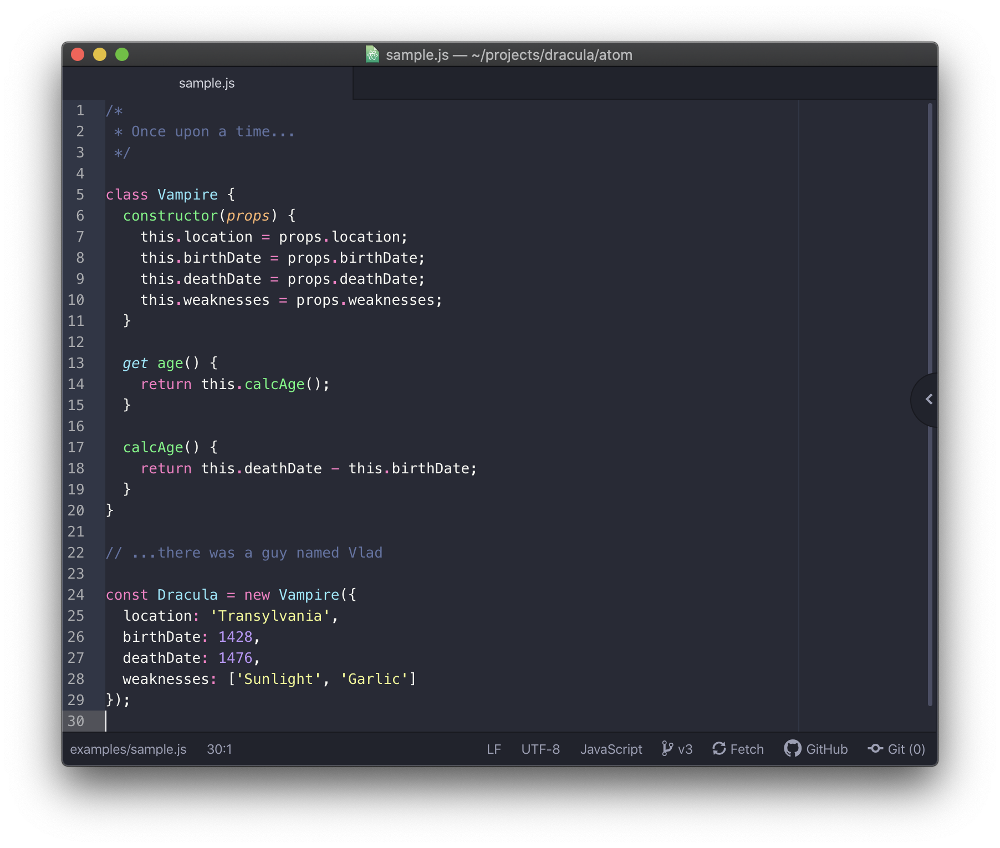
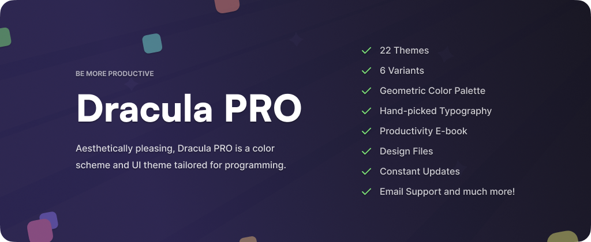

# Dracula for [Atom](https://atom.io)

> A dark theme for [Atom](https://atom.io).

## Install

All instructions can be found at [draculatheme.com/atom](https://draculatheme.com/atom).

## Screenshots

 

 

 

 

 

 

 

 

 

 

 

## Issues

If you are running into an issue where Atom is constantly asking you to update the package, it may have to do with the rename from `dracula-theme` to `dracula-syntax`. Uninstalling `dracula-theme` and `dracula-syntax` and reinstalling `dracula-syntax` should fix this problem.

## Related

- [UI theme](https://github.com/dracula/atom-ui)

## Team

This theme is maintained by the following person(s) and a bunch of [awesome contributors](https://github.com/dracula/atom/graphs/contributors).

|  |
| -------------------------------------------------------------------------------------------------------------- |
| [Jimmy Multani](https://github.com/JimmyMultani)                                                               |

## Community

- [Twitter](https://twitter.com/draculatheme) - Best for getting updates about themes and new stuff.
- [GitHub](https://github.com/dracula/dracula-theme/discussions) - Best for asking questions and discussing issues.
- [Discord](https://draculatheme.com/discord-invite) - Best for hanging out with the community.

## Dracula PRO

## License

[MIT License](./LICENSE)
